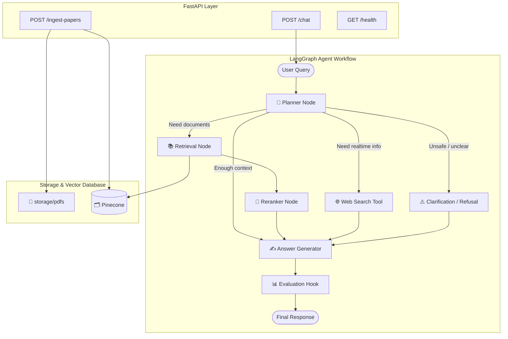

# Agentic arXiv Research Q&A

An Agentic Research Q&A Application built to answer questions based on recent AI papers from arXiv (`cs.AI`).

Unlike rigid RAG pipelines, this app uses a LangGraph-powered agent to autonomously decide whether to:

- Search the vector database
- Browse the web
- Ask the user for clarification
- Decline out-of-scope requests

---

# [Demo Video](https://youtu.be/c-DDD2RRl1k)

---

# Table of Contents

- Architecture Overview
- Quickstart / Setup Instructions
- Decisions Log
- Next Goals
- Known Limitations

---

# Architecture Overview

The system is decoupled into:

- **Frontend** → React + Vite
- **Backend** → FastAPI
- **Agent Orchestration** → LangGraph
- **Vector Store** → Pinecone Hybrid Search

### Backend Architecture Diagram




# Core Components

## Backend

FastAPI application exposing endpoints:

- /chat
- /ingest
- /health

## Agent Workflow

Built with LangGraph.

The agent uses an LLM to evaluate the user's prompt and route it to specific nodes:

- Retrieve
- Search
- Clarify
- Decline
- Answer
- Knowledge Store

Document ingestion pipeline that:

- Chunks PDFs
- Generates dense embeddings
- Calculates sparse vectors (BM25)
- Stores hybrid vectors in Pinecone
- Uses reranking for relevance optimization

---

# 🚀 Quickstart / Setup Instructions

---

You can have this project running locally

### Prerequisites

- Python 3.11+
- Node.js 18+
- Mistral API key -->  [Click Here To Genrate API Key](https://console.mistral.ai/home?profile_dialog=api-keys)
- Pinecone API key + index  --> [Click Here To Genrate API Key + Index](https://app.pinecone.io/organizations/-Op2-Q7FpFgvWF4VgBEO/projects/c31e361b-6cb1-4eb2-becd-b7c38268c03a/keys)

---

## 1️⃣ Clone the Repository

```
git clone https://github.com/singh-gaurav04/Agentic_RAG_System.git

cd Agentic_RAG_System
```

## 2️⃣ Backend Setup

```bash
# create virtual environment 

python -m venv venv

# Linux / macOS
source venv/bin/activate

# Windows
venv\Scripts\activate

#Download all the dependencies 
pip install -r requirements.txt
```

Create `.env` in repo root:

```env
MISTRAL_API_KEY=...
MISTRAL_MODEL=mistral-large-latest
MISTRAL_EMBEDDING_MODEL=mistral-embedding-v1

PINECONE_API_KEY=...
PINECONE_INDEX=skyclad
TOP_K_FINAL=10
```

Start Backend Server:

```bash
uvicorn src.main:app --reload
```

### 3️⃣ Frontend Setup

```bash
#open a new terminal

cd frontend
npm install

#Start Vite Dev Server

npm run dev
```

---
## Ingesting corpus data

Use `POST /ingest-papers` to fetch and index arXiv papers.

Example payload:

```json
{
  "max_papers": 50,
  "category": "cs.AI",
  "days_back": 90,
  "batch_size": 10
}
```

PDFs are stored under `storage/pdfs`.
---

---
## Repository structure

```text
src/
  config/                 # settings and env configuration
  graph/                  # LangGraph state, nodes, workflow routing
  ingestion/              # arXiv fetch, PDF parsing, chunking
  retrieval/              # vector store, hybrid retriever, reranker
  routes/                 # FastAPI routes (/chat, /ingest-papers, /health)
  schemas/                # request/response and planner schemas
  tools/                  # external tools (web search)

frontend/
  src/components/         # ChatPanel, IngestionPanel
  src/services/           # API client

eval/
  questions.json          # evaluation prompts + expected actions
  run_eval.py             # eval runner
```
---

# Decisions Log

---

### LangGraph

I used LangGraph because the app follows a multi-step agent workflow with branching logic, not just a single LLM call. It helped me manage shared state across nodes like planning, retrieval, reranking, clarification, and final response generation.

### Pinecone

I used Pinecone as the vector database to store and retrieve research paper embeddings efficiently at scale. Its hybrid search support (dense + sparse retrieval) made it easier to improve search accuracy for technical AI terms and acronyms.

### FastAPI

I chose FastAPI because it works well for async AI applications and made it easy to expose clean APIs for chat, ingestion, and health checks. It also integrates smoothly with React and LangGraph workflows.

### Mistral AI

I used Mistral AI for both chat generation and embeddings to keep the stack simple and consistent. Using the same provider for reasoning and vector embeddings helped reduce integration complexity and maintain better model compatibility.

---

# Next Goals

---

### 1. Persistent Memory

I already implemented persistent memory, but with more time I would make the session storage more production-ready using durable database-backed checkpointing and cleaner recovery handling.

### 2.Streaming Responses

I would add real-time streaming support using Server-Sent Events (SSE) or WebSockets so users can see intermediate agent steps and token-by-token responses instead of waiting for the full output at once.

### 3. Semantic / Episodic Memory

If time allowed, I would extend the current memory system with semantic or episodic memory so the assistant could better remember long-term user context and conversation patterns.

### 4. Better Observability

I would add a proper trace/debug panel in the frontend so users can visually follow the agent workflow step-by-step, including planning, retrieval, tool usage, and final response generation.

### 5. Production Readiness

I would improve production safety by tightening CORS settings, adding rate limiting/API protection, and making backend error handling more structured and predictable.

### 6. Better Evaluation System

I would improve evaluation beyond routing accuracy by adding answer-quality checks, citation validation, and retrieval comparison tests to measure how reliable the system actually feels to users.

---

## Known limitations

---

- No full long-term semantic/episodic memory module in active runtime path.
- Eval focuses on planner action matching more than answer-quality metrics.
- Tool fallback quality depends on external search reliability.
- Production hardening (auth/rate limiting/restricted CORS) is not fully enabled by default.

---


